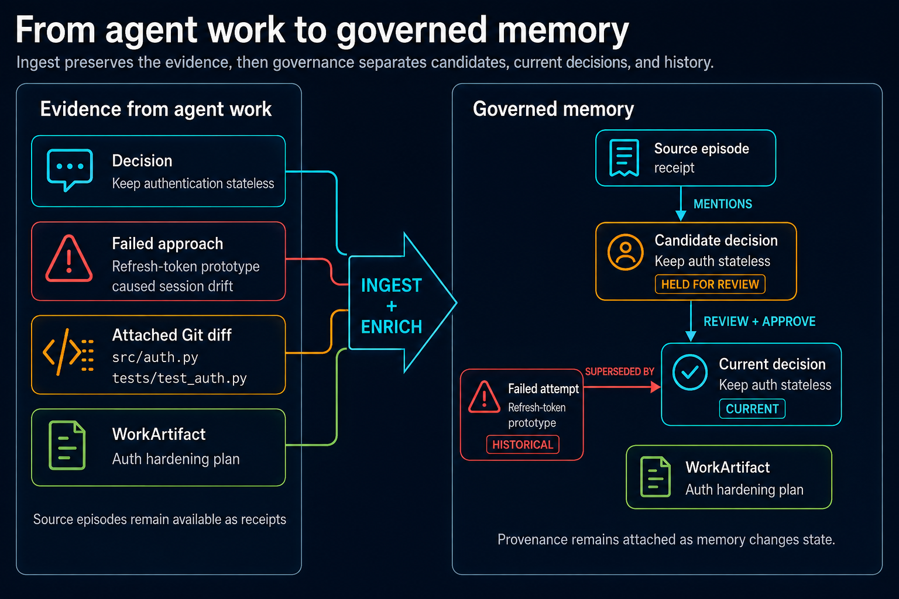
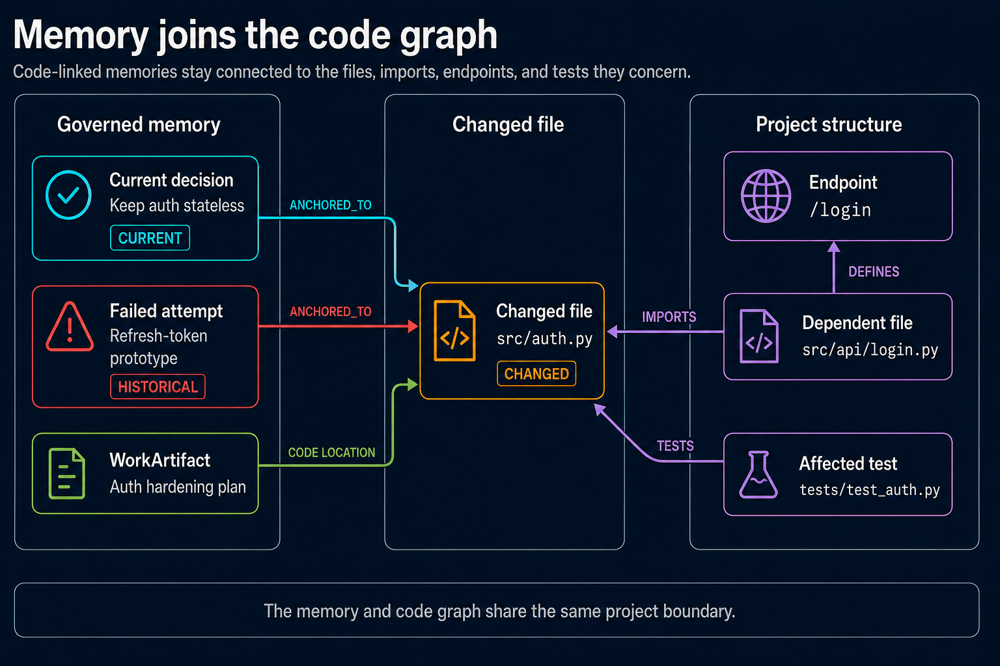
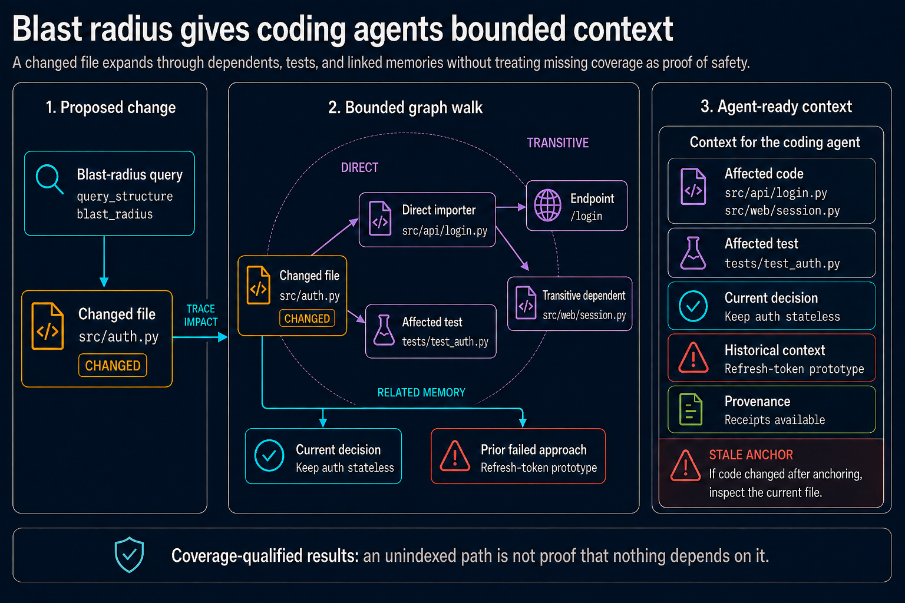

# Menhir

> Git records what changed. A code index records what depends on it. Menhir keeps the
> evidence and decisions behind agent work, including what later became stale or
> superseded and which files and tests still carry the impact.

Menhir is a [Model Context Protocol](https://modelcontextprotocol.io/) memory and
code-context service built for coding agents. It stores source episodes and governed
semantic memory in the same [Neo4j](https://neo4j.com/) graph as files, symbols, callers,
and tests. Paths and attached Git diffs connect decisions, failed approaches, plans, and
handoffs to the code they concern.

[Graphiti](https://github.com/getzep/graphiti) handles entity extraction and graph search.
Menhir adds project indexing, impact analysis, currentness and lifecycle policy,
provenance, typed state, and agent-facing tools.

The current package version is `0.2.0`. Menhir is built for a single operator, requires
Python 3.12 or newer, and exposes 52 MCP tools plus 9 read-only MCP resources.

[Quick start](#quick-start) | [Agent workflow](#a-coding-loop) |
[Blast radius](#code-graph-and-blast-radius) |
[Governance](#governance-and-currentness) | [Security](#security-and-privacy)

## Why Menhir is useful for agentic coding

Menhir's main distinction is the connection between remembered context and live code
structure. A result can carry the files it belongs to, the code and tests affected by a
change, an advisory stale-anchor label, and receipts showing where the claim came from.

| Capability | What the coding agent gets |
|------------|----------------------------|
| Structural code graph | Files, symbols, imports, calls, tests, endpoints, dependencies, and cross-project references |
| Code-linked memory | Memories anchored to repository paths found in their narrative or attached Git diff |
| Change analysis | Direct and transitive dependents, function callers, affected tests, and related memories in one blast-radius query |
| Governed recall | Review-only candidates, persistent memory, operator-promoted ground truth, superseded history, conflicts, and source receipts |
| Typed state | Immutable scalar assertions folded into rebuildable current-state and history Views |
| Engineering artifacts | Plans, reviews, investigations, implementation reports, and handoffs with typed status and relationships |
| Agent integrations | Optional prompt and file-event hooks that preserve durable context without installing themselves or blocking the coding session |

### How the pieces connect

These diagrams follow one synthetic authentication change from agent evidence through
governed memory, code structure, and blast-radius context.







The structural and semantic entities live in the same Neo4j graph and share project and
namespace boundaries. A client does not have to join independent responses from a code
index and a memory service.

Current development is concentrated on ingest and projection correctness for typed
scalar state. The [typed scalar section](#typed-scalar-memory-and-current-priorities)
explains why that work comes before further retrieval tuning and which authority paths
remain off by default.

### A coding loop

A typical agent session can use Menhir at each stage:

1. Run `ingest_project` to build or refresh the repository graph.
2. Before editing, use `query_structure` for local context, blast radius, and affected
   tests. Pass `file_context` to `recall_memories` to pull in code-linked decisions,
   failures, and constraints.
3. During the session, optional hooks can collect durable user-provided evidence and
   mark changed files dirty. Hook failures do not block the coding agent.
4. After the change, attach the Git diff to `add_memory` so new lessons can be anchored
   to touched files. Record remaining code work with repository-relative todo locations,
   and update any plan, review, report, or handoff artifacts.

```text
repository scan -> structural code graph
memory + Git diff -> semantic graph -> ANCHORED_TO file
changed file -> blast radius -> affected code + tests + related memories
file event -> stale anchor label -> agent checks the current file
```

Menhir does not infer the editor's active file. The client must pass `file_context`, and
the project must be indexed before structural queries or anchors can be trusted.

## Code graph and blast radius

`ingest_project` indexes repository files, symbols, imports, calls, tests, endpoints,
dependencies, and nested project relationships. A watcher checks indexed projects every
30 minutes using file fingerprints.

`query_structure` can answer local questions about a module, but its more useful coding
queries follow a proposed change through the graph:

- `blast_radius` walks reverse imports transitively, reports function-level callers and
  cross-project references, maps affected tests, and returns memories anchored to the
  affected files
- `affected_tests` narrows the result to relevant test files and produces a minimal
  `pytest` command
- `context` gathers a file's symbols, imports, importers, tests, and linked memories
- `endpoints`, `dependencies`, `symbols`, and `cross_refs` expose narrower views when an
  agent needs evidence instead of a full impact report

```text
changed module
  -> direct importers and callers
  -> transitive dependents and cross-project references
  -> affected tests
  -> semantic memories attached to the impacted files
```

Negative answers are qualified by index coverage. If a requested path was not indexed,
Menhir refuses to present an empty blast radius as proof that nothing depends on it. It
also distinguishes a stale project root from a current scan. This matters for coding
agents, where an incomplete graph can otherwise turn "not found" into a risky claim of
"safe to change."

## Code-related memory

`add_memory` queues an episode for entity and relationship extraction. During
enrichment, Menhir finds repository paths in the narrative and any attached Git diff,
normalizes those paths, resolves them against the structure graph, and writes
`ANCHORED_TO` relationships. The original episode remains available as provenance.

Recall can then start from code instead of wording alone. Passing `file_context` adds
memories attached to the file, its imports, its importers, and its tests to the candidate
pool even when semantic or lexical search did not find them. Blast-radius results use
the same anchors to put earlier decisions and failures beside the affected code.

An optional file-event hook for Claude Code and Codex observes edit, write, create,
delete, and rename events. It sends the path and optional hash, modification time, Git,
and session metadata, but not file contents or transcripts. If the file changed after a
memory was anchored, recall labels that anchor stale and tells the agent to inspect the
current file. The label is advisory: it does not delete or downrank the memory, rebuild
the project index, or automatically rewrite the anchor. See the
[hook event contract](docs/hook-center-tool-events.md).

Optional TurnEvidence hooks for Claude Code, Codex, and OpenCode inspect user prompts
with deterministic triage. They retain only prompts that look durable enough for later
ingestion, not assistant messages, tool output, or a full transcript. See the
[TurnEvidence producer contract](docs/turn-evidence-producers.md).

## Governance and currentness

Stored text is not treated as equally authoritative. Menhir separates review state,
lifecycle state, and operator authority:

| State | Recall behavior |
|-------|-----------------|
| `CANDIDATE` | Low-trust staging area. Candidates are withheld from recall until a human approves them. |
| `PERSISTENT` | Normal durable memory that remains subject to conflict and lifecycle handling. |
| `PROMOTED` | Operator-curated, verified ground truth. Only persistent memory can be promoted, and normal merge handling cannot absorb it. |
| Superseded or historical | Kept for audit and historical queries, but omitted from current-belief recall by default. |

`get_provenance` expands a memory or derived View into its source episodes, first-class
evidence, and structural anchor paths. Conflict tools can scan, review, and explicitly
resolve contradictory memories. Removing promoted content requires an explicit
operator override. Namespaces and credential tiers keep projects and client roles
separate within the single-operator trust model.

Menhir also treats engineering documents as `WorkArtifact` objects. Git still owns the
Markdown bytes; Menhir tracks stable identity, type, status, code locations, open
questions, and relationships such as `reviews`, `implements`, `informs`, and
`supersedes`. Supersession moves the old artifact's status and writes the relationship
together, so a later agent does not have to guess which plan or handoff is current.
Repository-relative todo locations use the same rule: paths and optional symbols or line
ranges are normalized, while unresolved references remain unresolved instead of being
guessed.

Some read-side authority gates, event-history authority, deterministic scalar routing,
and retrieval experiments remain opt-in. The
[activation ledger](.agent/default-off-features.md) records their actual default state
and the evidence required before activation.

## How memory moves through the system

### Ingestion

`add_memory` writes an episode to the queue and returns without waiting for extraction.
A background worker sends it to the configured LLM, merges extracted entities and
relationships into Neo4j, and records scope, provenance, and structural anchors.

```text
episode -> queue -> LLM extraction -> Neo4j merge -> metadata -> structural anchors
```

### Recall

Graphiti supplies candidates using hybrid BM25 and vector search. Menhir reranks them
with semantic similarity, graph adjacency, recency, prominence, and conflict signals.
File-linked candidates can enter through structural context even when they were absent
from the text search results.

The repository does not claim that this is universally better than vector-only search.
Retrieval quality still depends on the stored evidence, provider, index coverage, and
tuning.

### Lifecycle

Memories can be session-scoped, persistent, active, compressed, promoted, flagged, or
marked gone. Daily maintenance runs consolidation and decay checks. Eligible inactive
memories may be compressed, and compressed content can be rehydrated when new context
arrives. Flagged and promoted memories receive stronger retention protection.

Automatic transitions from `COMPRESSED` to `GONE` are disabled. The old deletion
threshold did not provide a safe basis for irreversible removal. An operator can still
delete memory manually, while automatic decay favors retention until a replacement
policy is validated.

## Typed scalar memory and current priorities

Recent work has focused on turning grounded statements into typed, auditable state. This
is different from storing another prose summary. The scalar path keeps the original
observation and derives a current value that can be rebuilt:

```text
TurnEvidence
  -> typed scalar perception and admission
  -> immutable TypedAssertion
  -> deterministic fold
  -> ScalarStateView and ScalarHistoryView
```

A typed assertion records the subject, attribute, value, unit, operation, source span,
namespace, and time. The fold can combine an absolute value with later deltas, handle
corrections and supersession, and retain the assertions that contributed to the current
View. `ScalarStateView` represents current state. `ScalarHistoryView` is an advisory
record of changes rather than a competing source of current truth.

The scalar assertion, persistence, fold, repair, and inspection infrastructure is
implemented. Scalar-state activation and recall authority remain opt-in while the system
is checked against held-out extraction, namespace, replay, and repair cases. The
deterministic extractor and router are also default-off; the extractor can run as an
observe-only shadow without changing persistence or recall. Event-history authority
follows the same rollout discipline and remains default-off.

### Why ingestion comes first

Menhir treats retrieval as the evidence selector, not the place where missing semantic
structure should be invented. Recall cannot repair a fact that was never extracted, was
bound to the wrong subject or namespace, lost its provenance, or folded into the wrong
current value.

That makes ingest and projection correctness the current priority. The work is ordered
around four questions:

1. Did perception extract the atomic claim from an exact source span?
2. Was the claim admitted, bound, and namespaced correctly?
3. Can the durable assertions deterministically rebuild the expected View?
4. Can replay, repair, and coverage checks account for every assertion and projection?

Retrieval and context presentation come after those checks. This is also why tentative
intent is planned as an ingest-owned assertion and View instead of a recall-time phrase
classifier. Until admitted Intent Views exist, ordinary prose remains general content.

The [typed recall packet decision](.agent/plans/typed-recall-packet-prototype.md) records
the ingest-owned boundary. The
[projection and realization coverage plan](.agent/plans/menhir-projection-realization-coverage-implementation.md)
describes the next reliability and observability work. The
[activation ledger](.agent/default-off-features.md) lists the paths that are shipped but
not enabled by default.

## Interfaces

`menhir serve` starts one long-lived FastAPI process. That process owns the Neo4j pool,
the enrichment queue, and the maintenance scheduler.

| Interface | Default location | Notes |
|-----------|------------------|-------|
| Remote MCP | `http://127.0.0.1:8100/mcp-http` | Streamable HTTP transport |
| REST API | `http://127.0.0.1:8100/api` | Health, readiness, memory, and operator routes |
| Explorer | `http://127.0.0.1:8100/explorer` | Browser-based graph inspection |
| Stdio bridge | `python -m menhir.mcp.server` | Trusted local bridge to a running backend |

The stdio bridge does not create a second runtime. Set `MENHIR_BACKEND_URL` to the
running HTTP backend before launching it.

## Quick start

### Prerequisites

- Python 3.12 or newer
- Git, because two first-party dependencies install from public GitHub repositories
- Neo4j 5 with APOC
- a local OpenAI-compatible server, OpenAI, or Gemini

### Install

```bash
git clone https://github.com/Archolith/menhir.git
cd menhir
python -m pip install .
menhir setup
```

For an editable development install with the PEP 735 development dependency group:

```bash
python -m pip install -e . --group dev
```

The dependency-group command requires pip 25.1 or newer.

`menhir setup` is the idempotent post-install step for a source checkout. It creates `.env` only
when missing and enables the repository-managed Git hooks without replacing a custom hooks path.
Run `menhir setup --check` to audit without changing anything. Runtime, MCP client, optional agent
hook, and Windows watchdog steps are listed in [`docs/post-install.md`](docs/post-install.md).

### Configure

```bash
# Edit .env for your Neo4j and LLM provider.
# If you skipped `menhir setup`: cp .env.example .env
```

The default configuration expects Neo4j and a local OpenAI-compatible model server on
the same machine.

| Variable | Purpose | Default |
|----------|---------|---------|
| `NEO4J_URI` | Neo4j connection | `bolt://localhost:7687` |
| `NEO4J_USER` | Neo4j user | `neo4j` |
| `NEO4J_PASSWORD` | Neo4j password | empty |
| `LLM_CHAT_PROVIDER` | Chat provider: `local`, `openai`, or `gemini` | `local` |
| `GRAPHITI_LLM_PROVIDER` | Graphiti extraction provider | `local` |
| `GRAPHITI_EMBED_PROVIDER` | Optional separate embedding provider | inherits Graphiti provider |
| `LOCAL_LLM_BASE_URL` | Local OpenAI-compatible chat endpoint | `http://127.0.0.1:8081/v1` |
| `OPENAI_API_KEY` | Credential used when the provider is `openai` | empty |
| `GEMINI_API_KEY` | Credential used when the provider is `gemini` | empty |
| `SCHEDULER_URL` | Optional external model scheduler | `http://localhost:8082` |

See [`.env.example`](.env.example) for model names, separate embedding endpoints, OAuth,
telemetry, and experimental flags.

### Start Neo4j

The root compose file starts a local Neo4j 5 instance with APOC:

```bash
docker compose up -d
```

The root compose file uses `neo4j/password`, so set `NEO4J_PASSWORD=password` in `.env`.
To use an existing database, configure it directly:

```dotenv
NEO4J_URI=bolt://neo4j-host:7687
NEO4J_USER=neo4j
NEO4J_PASSWORD=replace-me
```

### Check and run Menhir

```bash
menhir check
menhir diagnostics
menhir serve
```

`menhir diagnostics --json` reports the redacted local security posture without printing
secrets or connecting to the network or database. Once the server starts, use these
endpoints for process and dependency checks:

```bash
curl -fsS http://127.0.0.1:8100/api/health
curl -fsS http://127.0.0.1:8100/api/ready
```

Other CLI commands include `menhir console` for an interactive shell and
`menhir serve-watch` for a local restart watchdog.

### Connect an MCP client

Point an HTTP-capable MCP client at `/mcp-http`:

```json
{
  "mcpServers": {
    "memory": {
      "type": "http",
      "url": "http://127.0.0.1:8100/mcp-http",
      "headers": {
        "Authorization": "Bearer <your-key>"
      }
    }
  }
}
```

Static credentials can be configured with `MENHIR_API_KEY`, `MENHIR_AGENT_KEY`,
`MENHIR_OPERATOR_KEY`, or `MENHIR_READONLY_KEY`. The credential tier controls which tools
the client may call.

If no credential is configured, Menhir permits open access only on a loopback bind. See
[Security](#security) before exposing the service to another machine.

Clients may also identify themselves by name with the `X-Menhir-Client-Name` header, which
`MENHIR_CLIENT_NAMESPACES` and `MENHIR_CLIENT_TOOLS` use to pin a client to one namespace or
restrict it to a subset of tools. These are unset by default and most deployments need none of
them. **Configuring the first one is a breaking change for every other client:** once any
per-client restriction exists, an unrecognized name is refused rather than treated as
unrestricted, so every remaining client must be listed in `MENHIR_KNOWN_CLIENTS` in the same
edit. See [`.env.example`](.env.example) for the full rules, including which names must *not*
be added to `MENHIR_KNOWN_CLIENTS`.

## Docker test stack

The deployment compose file starts Menhir and an isolated, disposable Neo4j instance.
It is a test stack, not a production template, and its supplied configuration uses
OpenAI for extraction and embeddings.

```bash
cp deploy/.env.deploy.example deploy/.env.deploy
# Set OPENAI_API_KEY and MENHIR_OPERATOR_KEY in deploy/.env.deploy.
docker compose -f deploy/docker-compose.full.yml up -d --build
curl -fsS http://127.0.0.1:8099/api/health
```

The compose file publishes Menhir on loopback and enables client tokens. If you run the
image directly with a non-loopback bind, configure authentication or startup will fail.
Do not connect this stack or its tests to a graph that contains data you want to keep.

Two path and networking details matter in Docker:

- `ingest_project` records absolute paths. Mount source code at the same path seen by the
  MCP client if you want `file_context` and structural anchors to match.
- `127.0.0.1` inside a container is the container itself. To use a model server on the
  host, set `LOCAL_LLM_BASE_URL` to an address such as `host.docker.internal`.

See [`deploy/README.md`](deploy/README.md) for client-token bootstrap and deployment
details.

## Security and privacy

Menhir is a single-operator service, not a multi-tenant boundary. Run a separate instance
for each operator or trust domain. The full threat model and known limitations are in
[`docs/security-posture.md`](docs/security-posture.md).

With no key configured, the server refuses non-loopback binds. Bypassing that guard with
`MENHIR_ALLOW_INSECURE_REMOTE_NO_AUTH=1` is unsafe and is intended only for an isolated
local lab network.

For OAuth resource-server deployments, follow the
[remote MCP checklist](docs/runbooks/oauth-remote-mcp-checklist.md). It covers metadata,
bearer challenges, query-string credential rejection, and token smoke tests without
claiming compatibility with a particular client.

Installing or starting Menhir does not silently install editor or agent capture hooks. If you enable the
included TurnEvidence hooks, accepted prompts may be stored with working-directory, Git,
and transcript-path metadata. The separate file-event hook stores path and change
metadata without file contents. Review the
[TurnEvidence producer documentation](docs/turn-evidence-producers.md) and
[file-event contract](docs/hook-center-tool-events.md) before using hooks for sensitive
work.

Report vulnerabilities privately as described in [`SECURITY.md`](SECURITY.md). Do not
open a public issue for a security report.

## Selected MCP tools

Menhir registers 52 tools. These are the main entry points; clients can discover the full
set through the MCP gateway.

### Store and retain memory

| Tool | Purpose |
|------|---------|
| `add_memory` | Queue a memory for enrichment |
| `add_memory_and_track` | Queue a memory and stream processing progress |
| `ingest_document` | Ingest a document as memory episodes |
| `add_candidate` | Stage low-trust context for human review without making it recallable |
| `flag_memory` | Protect a memory from normal lifecycle decay |
| `promote_memory` | Mark persistent memory as operator-verified ground truth |
| `delete_memory` | Delete a memory under operator control |

### Recall and context

| Tool | Purpose |
|------|---------|
| `recall_memories` | Search and rerank memories, with optional file context |
| `recall_context_memories` | Retrieve recent and relevant startup context |
| `read_flagged_memories` | Read memories selected for bootstrap |
| `build_context` | Assemble context within a token budget |
| `get_provenance` | Expand a result into source episodes, evidence, and code anchors |
| `rate_recall` | Record explicit retrieval feedback |

### Inspect projects and operations

| Tool | Purpose |
|------|---------|
| `ingest_project` | Index a repository's structure |
| `query_structure` | Query code context, blast radius, affected tests, symbols, endpoints, dependencies, and cross-project references |
| `get_enrichment_status` | Inspect one episode's processing state |
| `watch_enrichment` | Monitor enrichment changes |
| `get_episode_trace` | Read queue and telemetry history for an episode |
| `get_memory_stats` | Summarize latency, failures, and queue depth |

### Resolve conflicts

| Tool | Purpose |
|------|---------|
| `list_conflicts` | List grouped contradictions |
| `resolve_conflict` | Keep both memories, replace one, or discard the new one |
| `scan_for_conflicts` | Scan for similarity-based conflict candidates |
| `run_llm_conflict_review` | Ask the configured LLM to review unresolved conflicts |

### Track engineering work

| Tool | Purpose |
|------|---------|
| `add_todo` | Create a todo with an optional normalized code location |
| `list_artifacts` | Find plans, reviews, investigations, reports, and handoffs by type or status |
| `get_artifact` | Read one artifact with its current metadata and Git-backed content |
| `link_artifacts` | Record a typed `reviews`, `implements`, or `informs` relationship |
| `transition_artifact` | Apply a legal status transition for that artifact type |
| `supersede_artifact` | Replace an artifact while updating status and relationship atomically |

The tool set also includes client-token administration, scheduler controls, todo
cleanup, artifact questions, and enrichment repair.

## Retrieval scoring

Menhir combines five signals after candidate retrieval:

```text
score = similarity + alpha*adjacency + beta*recency + gamma*prominence + delta*conflict
```

| Signal | Meaning |
|--------|---------|
| Similarity | Semantic and lexical relevance from Graphiti retrieval |
| Adjacency | Connections to other candidates in the graph |
| Recency | How recently the memory was accessed |
| Prominence | The memory's graph connectivity |
| Conflict | A boost for unresolved contradictions when requested |

Presets named `knowledge`, `recent`, `connected`, `emotional`, and `conflict` adjust the
weights for different recall tasks.

## Tests

The default pytest run covers the offline suite. Tests marked `online` skip unless
`--run-online` is present.

```bash
pytest
pytest -m unit
```

The CI graph-backed job uses a disposable Neo4j instance and excludes the small subset
that requires a live LLM:

```bash
docker compose -f docker-compose.test.yml up -d
MENHIR_TEST_NEO4J_URI=bolt://localhost:7688 \
  pytest -m "online and not needs_llm" --run-online
docker compose -f docker-compose.test.yml down -v
```

Online tests run destructive, unscoped graph queries. Never point them at a database that
contains data you want to keep.

## Project layout

```text
src/menhir/
|-- api/             FastAPI routes, authentication, OAuth, and remote MCP
|-- cli/             Command-line interface and hook commands
|-- config/          Environment-backed runtime settings
|-- core/            Runtime construction and service wiring
|-- domain/          Memory models, policies, recall types, and scoring
|-- explorer/        Browser-based graph explorer
|-- infrastructure/  Neo4j, Graphiti, telemetry, and structure queries
|-- mcp/             MCP tools, resources, contracts, and stdio bridge
`-- services/        Ingestion, recall, lifecycle, conflict, and scheduler logic
```

## License

Menhir is licensed under the [Apache License 2.0](LICENSE). See [NOTICE](NOTICE) for
attribution and [THIRD-PARTY-LICENSES.txt](THIRD-PARTY-LICENSES.txt) for dependency
licenses.

## Contact

For general questions, contact [contact@archolith.dev](mailto:contact@archolith.dev).
Report vulnerabilities privately through the process in [`SECURITY.md`](SECURITY.md).
